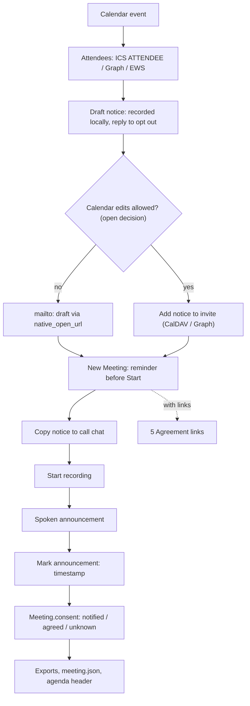

# 4 Consent local

Back: [[00 Roadmap]] · Prev: [[0c Foundations]] · Next: [[5 Agreement links]]

Nothing leaves the device; the user's own mail client sends the notice.

```mermaid
flowchart TD
  EV["Calendar event"] --> AT["Attendees: ICS ATTENDEE / Graph / EWS"]
  AT --> DR["Draft notice: recorded locally, reply to opt out"]
  DR --> HOW{"Calendar edits allowed? (open decision)"}
  HOW -- no --> MAIL["mailto: draft via native_open_url"]
  HOW -- yes --> INV["Add notice to invite (CalDAV / Graph)"]
  MAIL --> NM
  INV --> NM["New Meeting: reminder before Start"]
  NM --> CHAT["Copy notice to call chat"]
  CHAT --> ST["Start recording"]
  ST --> ANN["Spoken announcement"]
  ANN --> MK["Mark announcement: timestamp"]
  MK --> CS["Meeting.consent: notified / agreed / unknown"]
  CS --> EXP["Exports, meeting.json, agenda header"]
  NM -. with links .-> AL["5 Agreement links"]
  class AL internal-link
```
